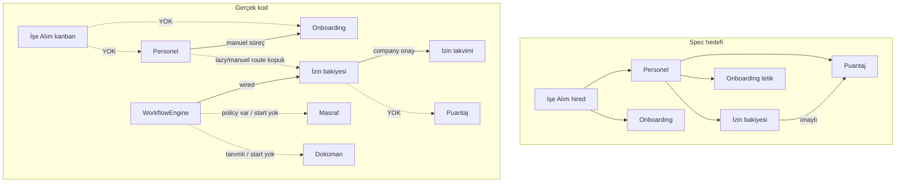

# ALATAX HR — Uçtan Uca Akış Envanteri

**Branch:** `faz4-form-engine`  
**Tarih:** 13 Temmuz 2026  
**Tür:** Teşhis (düzeltme yok)  
**Referans:** `SISTEM_ISLEYIS.md` (8 aşama) · `AKIS_SPEC.md` (Talep→Onay→Sonuç) · `MODUL_SPEC.md`  
**Yöntem:** Controller / route / FE sayfa / seeder / migration okuması. Runtime E2E tarayıcı testi yapılmadı; belirsizlikler not edildi.

**Durum etiketleri**

| Sembol | Anlam |
|--------|--------|
| ✅ TAM | Kullanıcı işi uçtan uca tamamlayabilir (bilinen kritik bug yok) |
| 🟡 YARIM | Başlıyor; bir veya daha fazla adımda zayıf/eksik/tutarsız |
| 🔴 KOPUK | Temel parça var ama zincir kırık (route yok, şema uyumsuz, UI yok…) |
| ⬜ YOK | Spec’te var; kodda yok veya yalnızca tablo/permission kalıntısı |

---

## 0. Özet sayaç

| Durum | Akış adedi (aşağıdaki tablolardaki satırlar) |
|-------|-----------------------------------------------|
| ✅ TAM | ~28 |
| 🟡 YARIM | ~32 |
| 🔴 KOPUK | ~24 |
| ⬜ YOK | ~18 |

> Sayılar “kritik kullanıcı alt-akışı” satırlarıdır; bir modülün genel skoru satırların karışımıdır. Yatay platform (Lookup, Ayarlar Stüdyosu, onay motoru, panel erişimi) ilerlerken **dikey ürün akışları** (özellikle işe alım başvurusu, izin bakiyesi atama, masraf HR UI, vardiya) geride kaldı — kullanıcı testinin “kopuk” hissetmesinin ana nedeni bu.

---

## 1. Modül × akış tablosu

### 1.1 Personel (M-A3)

| Akış | Durum | Kopukluk / not |
|------|-------|----------------|
| Personel oluştur (form → kayıt) | ✅ | `EmployeeForm` + `EmployeeController::store` |
| Detayda görünüm | ✅ | `EmployeeDetailPage` + sekmeler |
| Tüm sekmeler kaydet (genel/kişisel/iş/…) | 🟡 | Tek submit; tab başına ayrı save yok — pratikte çalışır, “sekme kaydet” UX’i yok |
| Departman ata | ✅ | `department_id` + Departmanlar CRUD |
| Yönetici ata | ✅ | `manager_id` + `getManagers` |
| Özel alan tanımla → formda görün → kaydet | ✅ | Custom fields + JSONB + Form Engine yüzeyi |
| Personel belgeleri (HR yükle / portal gör) | ✅ | `EmployeeDocumentController` + portal |
| Detay performans sekmesi | ⬜ | BE `show` aggregate var; FE sekme yok |
| İşten çıkış sihirbazı | ⬜ | Spec’te var; uçtan uca sihirbaz yok |
| Hire’dan personel otomatik oluştur | ✅ | B-2: `POST .../convert-to-employee` (hired → personel ön-doldurma; onboarding otomatik değil) |

---

### 1.2 İzin (M-B1) — kullanıcı bulguları

| Akış | Durum | Kopukluk / not |
|------|-------|----------------|
| İzin türleri seed (`migrate:fresh --seed`) | ✅ | `LeaveTypeSeeder` mevcut firmalara yazar |
| İzin türleri — **yeni register firma** | ⬜ | Register yalnızca varsayılan leave **workflow** seed eder; leave type seed etmez |
| Türler company-scoped | ✅ | `BelongsToCompany` |
| Company talep formunda tür listesi | 🔴 | **Kök neden (çoklu):** (1) Firmada tür yoksa boş. (2) `GET /leaves/types` → `permission:leaves.types.view` + `module.access:leave-management`; yetki/modül yoksa 403 → form toast. (3) `LeaveTypeController::index` `is_active` query’yi **uygulamaz**; `success(paginator)` dönüyor — FE `data` / `data.data` parse ediyor (genelde OK). Lookup `forType` **kullanılmıyor** — türler ayrı tablo. |
| Portal tür listesi | 🔴 | `PortalLeaveController::types` kolon drift riski (`unit`/`default_limit` vs şema `default_days`) — belirsiz: runtime doğrulanmadı |
| Personele bakiye **manuel atama** | ✅ | B-1: `PUT/PATCH .../leaves/balance/{id}` + bulk + `reason` + DataScope |
| Bakiye oluşumu (lazy, company talep) | 🟡 | İlk company `store`’da `firstOrCreate` + `default_days`; personel oluşturmada bakiye yok |
| Hakediş otomasyonu | 🟡 | Accrual policy CRUD + `process-monthly` endpoint var; **scheduler/cron yok**; bakiye kaydı olmayanlara accrual işlemez |
| Talep oluştur (company) | ✅ | Bakiye kontrolü + pending + workflow start |
| Talep oluştur (portal) | 🟡 | Bakiye/pending/workflow tutarsız veya eksik; company ile paralel ama zayıf |
| Onay motoru (workflow) | 🟡 | Leave’e bağlı; workflow yoksa legacy. Register/seed ile default workflow mümkün |
| Onayla → bakiye düş | ✅ | `approvePending` |
| Takvimde görün | 🟡 | Onaylı talepler calendar’da; `today`/`upcoming` route’suz |
| İptal (company) | ✅ | B-1: `POST .../leaves/requests/{id}/cancel` + Policy |
| Personel detay izin alan adları | ✅ | B-1: FE `total_days` (drift kapatıldı) |

**Kullanıcı cümleleri → kök neden özeti**

| Şikayet | En olası kök |
|---------|----------------|
| “İzin türleri talep formunda gelmiyor” | Firma için leave type seed edilmemiş **veya** modül/izin 403; Lookup değil |
| “Personele izin atayamıyorum” | ~~Bakiye update route yok~~ → **B-1 ile kapatıldı**; hakediş cron hâlâ borç |

---

### 1.3 İşe alım (M-B3) — kullanıcı bulguları

| Akış | Durum | Kopukluk / not |
|------|-------|----------------|
| Pozisyon / ilan CRUD | ✅ | Company FE + `JobPositionController` |
| İlanı “aktif/yayında” yap | ✅ | `status=active` |
| Başvuru formu builder (FE) | ⬜ | BE FormBuilder var; aktif company app’te UI yok (archive’te kalmış) |
| Pozisyona form bağlama (FE) | 🔴 | BE `form_id` kabul; `JobPositionForm` bağlamıyor |
| Public kariyer sayfası (FE) | ⬜ | Aktif SPA’da yok |
| Public job list API | ✅ | `status=active` |
| **Public başvuru API** | 🔴 | `Public\ApplicationController`: `status=published` arıyor (sistem `active` kullanıyor) + create alanları (`applicant_name` / `position_id`) migration şemasıyla (`first_name`/`last_name`/`job_position_id`) **uyumsuz** |
| Manuel aday ekleme (HR) | ⬜ | Applications `store` yok |
| Kanban UI + stage değiştir | 🟡 | UI var; **veri kaynağı boş/kırık** çünkü başvuru girişi yok → kullanıcı “form yok, paylaşamıyorum” |
| Mülakat planla / tamamla | 🟡 | CRUD var; alan adı drift (applicant_* vs first_name) |
| Teklif (offer) kaydı | ⬜ | Tablo kalıntısı; model/controller/FE yok |
| `hired` → personel | ✅ | B-2: convert-to-employee (ön-doldurma, idempotent) |
| `hired` → onboarding | ⬜ | Wire yok (bilinçli kapsam dışı) |

**Kanban boş mu?** Evet — kök çoğunlukla **başvuru oluşturma kanalının fiilen kırık/yok olması**, kanban bileşeninin kendisi değil.

---

### 1.4 Puantaj / vardiya (M-B2)

| Akış | Durum | Kopukluk / not |
|------|-------|----------------|
| Portal clock-in/out / mola | ✅ | `PortalTimesheetController` + portal UI |
| Portal haftalık/aylık | ✅ | |
| Portal vardiya görüntüleme | 🟡 | API var; portal UI çağırmıyor |
| Vardiya tanımı CRUD | ⬜ | Model/migration; controller/route/FE yok |
| Vardiya atama | ⬜ | `EmployeeShift` yazma API yok |
| HR attendance panosu (company) | ✅ | B-3: company nav + `/attendance` + DataScope/Policy |
| Onaylı izin → puantaja yansıma | ⬜ | Spec’te var; otomatik bağ yok (belirsiz/ kısmi değil — kodda wire görülmedi) |

---

### 1.5 Masraf (M-B8)

| Akış | Durum | Kopukluk / not |
|------|-------|----------------|
| Portal talep + fiş + submit | ✅ | |
| HR listele / onayla (BE) | ✅ | `ExpenseClaimController` |
| HR onay UI (company) | ✅ | B-3: onay kuyruğu + tüm talepler + markPaid + kategoriler |
| WorkflowEngine tetikleme | 🔴 | Policy workflow-aware; `submit` `startWorkflow` çağırmıyor; onay legacy |
| Kategori CRUD (HR) | ⬜ | Permission seed var; route yok |
| Ödendi (`paid`) adımı | 🟡 | Status enum’da var; onay sonrası ödeme adımı yok |

---

### 1.6 Doküman — firma (M-B10)

| Akış | Durum | Kopukluk / not |
|------|-------|----------------|
| Yükle → kategorile → görüntüle/indir | ✅ | |
| Versiyonlama | ✅ | |
| Onay workflow | 🔴 | `document_approval` entity tanımlı; upload’ta `startWorkflow` yok |

---

### 1.7 Performans (M-B5)

| Akış | Durum | Kopukluk / not |
|------|-------|----------------|
| Dönem → kriter → review → submit → approve | ✅ | Company (legacy onay, motor değil) |
| Portal görüntüleme / yorum | 🟡 | Tam döngü company’de |
| Sidebar alt path’ler (`/performance/periods`) | 🔴 | Nav link var; `App.tsx` route yok → `*` dashboard |

---

### 1.8 Eğitim (M-B6)

| Akış | Durum | Kopukluk / not |
|------|-------|----------------|
| Eğitim / oturum CRUD | ✅ | |
| Katılımcı ata | ✅ | |
| Yoklama / tamamlama FE | 🔴 | BE `updateAttendance` var; FE yok |
| Portal eğitim listesi | ✅ | |
| Sidebar `/training/sessions` | 🔴 | Route yok (tab içi) |

---

### 1.9 Varlık / zimmet (M-B7)

| Akış | Durum | Kopukluk / not |
|------|-------|----------------|
| Varlık oluştur → zimmet → iade | ✅ | |
| Personel detay zimmet sekmesi | ✅ | |
| Bakım UI | 🟡 | BE var; company bakım sayfası zayıf/yok |
| Sidebar alt path’ler | 🔴 | `/assets/categories` vb. App’te yok |
| `asset_request` workflow | ⬜ | Entity tanımlı; kullanılmıyor |

---

### 1.10 Anket (M-B9)

| Akış | Durum | Kopukluk / not |
|------|-------|----------------|
| Oluştur + sorular | ✅ | |
| Sonuç görüntüle | ✅ | |
| Audience dağıtım | 🔴 | BE alanları var; FE formda yok; portal tüm aktifleri listeler |
| Portal yanıtla | ✅ | |

---

### 1.11 Onboarding (M-B4)

| Akış | Durum | Kopukluk / not |
|------|-------|----------------|
| Şablon + süreç başlat + görev tamamla | ✅ | Manuel |
| Hire / personel create auto-trigger | ⬜ | Yok |
| FE’nin çağırdığı bazı API’ler | 🔴 | `duplicate` / `addTask` / `skipTask` / `dashboard` controller’da var, route eksik |
| Preboarding token link | ⬜ | Spec’te var |

---

### 1.12 Platform (yatay — bağlam)

| Akış | Durum | Not |
|------|-------|-----|
| Lookup Engine + Lookups UI | ✅ | Birçok modül `assertValid` / `forType` kullanıyor |
| Ayarlar Stüdyosu nav | 🟡 | Gruplu menü; içerik derinliği modüle göre değişir |
| Onay motoru (genel) | 🟡 | Leave’te pilot; expense/document/asset/training entity’leri çoğunlukla wire’sız |
| Panel erişimi /users filtresi | ✅ | Faz 4 test turu düzeltmesi |
| Form Engine (entity formları) | 🟡 | Custom fields yaygın; tam Form Engine + public job form FE eksik |

---

## 2. İlişki / entegrasyon haritası

| İlişki | Spec | Gerçek | Sınıf |
|--------|------|--------|-------|
| İşe alım → personel | Otomatik ön-doldurma | Yok | ⬜ |
| İşe alım → onboarding | Otomatik süreç | Yok | ⬜ |
| Personel → izin bakiyesi | İşe girişte hakediş | Lazy talep / route’suz manuel | 🔴 |
| Personel → onboarding | Yeni hire tetik | Manuel süreç başlatma | 🟡 |
| İzin onay → puantaj | İzinli gün | Wire yok | ⬜ |
| Onay motoru → izin | Evet | Var | ✅ / 🟡 |
| Onay motoru → masraf | Evet | B-3: submit→`startWorkflow`; yoksa legacy pending | ✅ / 🟡 |
| Onay motoru → doküman / eğitim / zimmet talebi | Evet | Entity string; akış yok | ⬜ / 🔴 |
| Lookup → personel / izin gender / başvuru stage / … | Yaygın | Çoğu modülde kullanılıyor; timesheet status hâlâ hardcoded | 🟡 |
| Public başvuru → kanban | Evet | API kırık + FE yok | 🔴 |

---

## 3. En kritik 5 kopukluk

*(Kullanıcının test edebilmesi için önce bunlara bakılmalı — öncelik sırası ürün etkisi.)*

| # | Kopukluk | Neden kritik | Durum |
|---|----------|--------------|-------|
| 1 | **İşe alım: aday başvurusu** | ~~Public apply kırık~~ → **B-2 ✅**; kariyer FE sınırlı | 🟡 |
| 2 | **İzin: bakiyeye manuel atama** | ~~Update route yok~~ → **B-1 ✅**; hakediş cron borç | 🟡 |
| 3 | **İzin: türlerin formda gelmemesi** | Seed/modül; portal types → **B-1 kısmen** | 🟡 |
| 4 | **Masraf / puantaj HR yüzeyi** | ~~Company yok~~ → **B-3 ✅**; vardiya/PDKS ayrı | 🟡 |
| 5 | **İşe alım → personel** | ~~hired kopuk~~ → **B-2 convert ✅**; onboarding oto ⬜ | 🟡 |

**Yakın takip:** Vardiya CRUD/PDKS; sidebar alt-URL → **B-4** (5 bağlandı, assignments kaldırıldı); anket audience; eğitim yoklama FE.

---

## 4. Spec vs gerçek — tek cümle

> Spec’teki yaşam döngüsü (aday → onboarding → günlük talep/onay → çıkış) **hedef resim**; mevcut kodda **personel CRUD, izin company talep/onay (kısmi), doküman, zimmet, performans company, anket oluştur/yanıt** görece olgun; **işe alım başvuru girişi, izin hak atama, masraf HR, vardiya, hire zinciri** kullanıcıyı durduran dikey boşluklar.

---

## 5. Kaynak dosyalar (teşhis çapaları)

| Alan | Örnek path |
|------|------------|
| İzin tür / talep | `LeaveTypeController`, `LeaveRequestController`, `LeaveRequestForm.tsx`, `LeaveTypeSeeder`, `routes/api.php` leaves grubu |
| İzin bakiye | `LeaveBalanceController`, `LeaveBalancesTab.tsx` |
| Public başvuru | `Public/ApplicationController.php`, `Public/JobController.php` |
| Kanban | `ApplicationsPage.tsx`, `Recruitment/ApplicationController` |
| Masraf | `PortalExpenseController`, `ExpenseClaimController`, `moduleNav.ts` (expenses yok) |
| Onay | `WorkflowService`, `ApprovalWorkflow`, `DefaultLeaveApprovalWorkflowService` |
| Portal puantaj | `PortalTimesheetController`, `TimesheetPage.tsx` (portal) |

---

**DURUM:** Envanter tamam · uygulama yok · commit: `docs: uçtan uca akış envanteri — modül olgunluk haritası`
